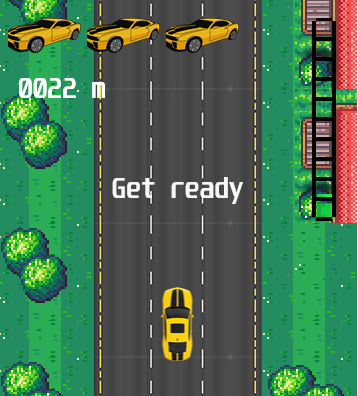

SpeedDriver
===================

A simple driving game implemented using the component-oriented approach in a pure HTML5 canvas. 

## Component architecture

Is based on a wonderful idea: there are no game objects, only a containers for components and attributes. The overall behavior of every game object is determined by the aggregation of components it contains.

### Game architecture 
- components are marked green, game entities are blue

### Source files
- `attributes.js` - contains game model 
- `compengine.js` - a very tiny component engine
- `compenginecom.js` - general components such as debuggging and handling inputs
- `constants.js` - constants used across the whole game 
- `imageloader.js` - a simple loader using promises
- `main.js` - entry point to the game, composes the game scene 
- `modelcomponents.js` - all components that affect the game state 
- `perlinnoise.js` - a simple noise used for randomness
- `sortedarray.js` - an extension providing arrays with ability to be sorted 
- `sprites.js` - configuration of sprites (they are all inside one atlas)
- `viewcomponents.js` - all components that are used only for rendering and don't affect the game model in any way

## Installation

Just open **game.html** and that's it - no npm, no imports, no libraries. The game also contains a debugging window that displays all components and attributes. To hide it, just remove line 71 in `main.js` where the component is added to the model.

### Debugging window 

`DebugComponent` is a component that goes over the whole scene and renders all game objects and their components 

## Control settings
* TAP to the lane left to the car - the car turns left
* TAP to the lane right to the car - the car turns right

